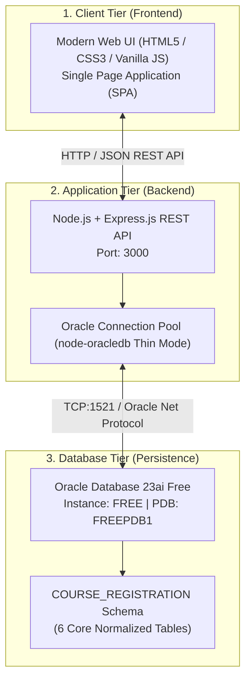
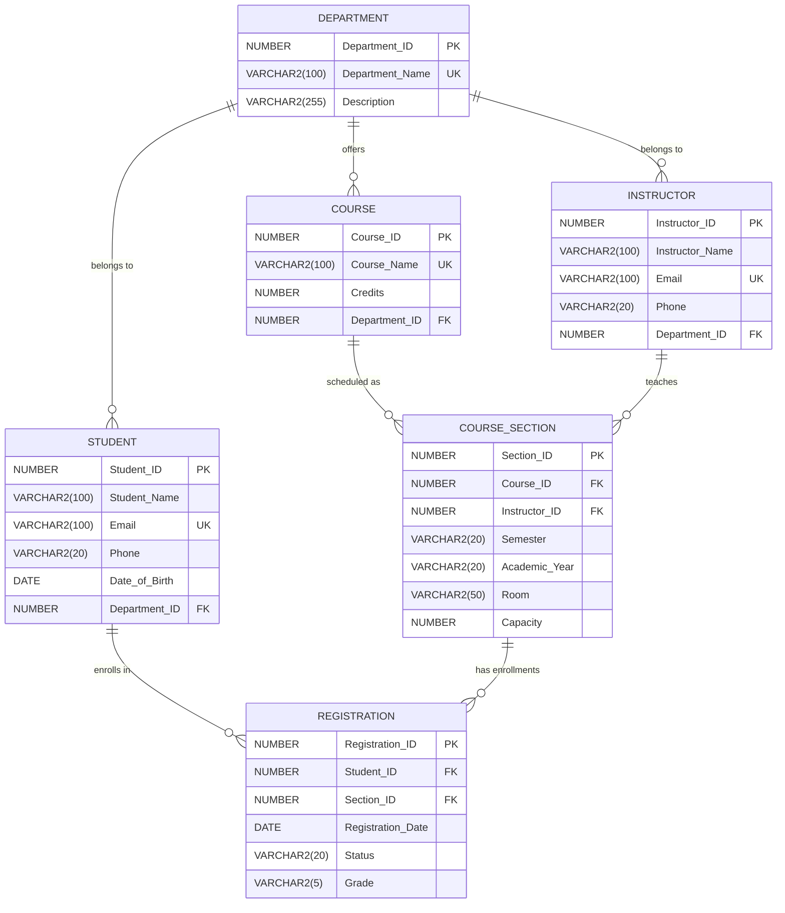

# Course Registration System (Academic DBMS Project)

[](https://www.oracle.com/database/)
[](https://www.oracle.com/)
[](https://nodejs.org/)
[]()

A complete, working, professional-looking, and academically sound **Course Registration System** built specifically for B.Tech Computer Science and Engineering students.

This project demonstrates core relational database concepts, 3rd Normal Form (3NF) schema design, constraints, sequence/trigger-based surrogate keys, multi-table joins, aggregate queries, subqueries, and real-time section capacity management using **Oracle Database 23ai** and **SQL*Plus**.

---

## 🌟 Key Project Highlights

- **Pure Oracle SQL Architecture**: Strictly written for **Oracle Database** and executable in **SQL*Plus** (no MySQL syntax, no AUTO_INCREMENT, no backticks).
- **Authoritative 6-Table Relational Schema**: Normalized into **3NF** without redundant attributes or anomalous dependencies.
- **Relational Integrity Enforcement**: Primary Keys, Foreign Keys, Not Null, Unique, and Check constraints enforced at the database engine level.
- **Business Rule Validation**:
  - **Duplicate Registration Prevention**: Enforced via composite constraint `UNIQUE(Student_ID, Section_ID)` and application pre-checks.
  - **Section Capacity Limits**: Enforces enrollment quotas (e.g., maximum 30 students per section) and rejects overflow requests with clear messaging.
- **Advanced Academic SQL**: Comprehensive scripts covering `INNER JOIN`, `LEFT JOIN`, `GROUP BY`, `HAVING`, `COUNT`, `AVG`, `MIN`, `MAX`, scalar subqueries, correlated subqueries, and relational views.
- **Simple 3-Tier Architecture**: Vanilla HTML5, CSS3, and JavaScript frontend connected to a lightweight Express.js server using Oracle's native `node-oracledb` Thin Mode driver.

---

## 🏗️ System Architecture



---

## 📊 Relational Database Design (3NF)



---

## 📁 Project Directory Structure

```
DBMS/
│
├── database/                          # Oracle SQL*Plus scripts
│   ├── 01_create_tables.sql           # DDL: Creates the 6 core tables
│   ├── 02_constraints.sql             # Primary, Foreign, Unique & Check constraints
│   ├── 03_sequences.sql               # Sequences for surrogate keys
│   ├── 04_triggers.sql                # BEFORE INSERT triggers for auto-IDs
│   ├── 05_insert_sample_data.sql      # Realistic academic dataset (15 students, 10 courses, etc.)
│   ├── 06_basic_queries.sql           # SELECT, WHERE, ORDER BY, pattern matching
│   ├── 07_join_queries.sql            # INNER JOIN, LEFT JOIN, multi-table queries
│   ├── 08_aggregate_queries.sql       # COUNT, AVG, MIN, MAX, GROUP BY, HAVING
│   ├── 09_subqueries.sql              # IN, NOT IN, EXISTS, scalar & correlated subqueries
│   ├── 10_views.sql                   # Relational views for fast querying & reporting
│   ├── test_constraints.sql           # PL/SQL constraint validation test script
│   └── run_all.sql                    # Master runner script for SQL*Plus
│
├── backend/                           # Express.js REST API
│   ├── server.js                      # Application server entry point
│   ├── db.js                          # Centralized Oracle connection pool module
│   └── routes/                        # Modular route controllers
│       ├── dashboard.js               # Database-calculated metrics endpoint
│       ├── departments.js             # Department CRUD
│       ├── students.js                # Student CRUD & search
│       ├── instructors.js             # Instructor CRUD
│       ├── courses.js                 # Course CRUD
│       ├── sections.js                # Course Section CRUD & seat tracking
│       ├── registrations.js           # Registration logic (capacity & duplicate check)
│       └── reports.js                 # 10 Academic analytical reports
│
├── frontend/                          # Web presentation tier
│   ├── index.html                     # Clean, accessible Single Page Application
│   ├── css/
│   │   └── style.css                  # Professional academic stylesheet
│   └── js/
│       ├── app.js                     # SPA router, form modals, and table rendering
│       └── api.js                     # Client REST API wrapper
│
├── docs/                              # Academic project documentation
│   ├── requirements.md                # Software Requirements Specification (SRS)
│   ├── database_design.md             # Schema specification, ERD & constraint rules
│   ├── architecture.md                # 3-tier architecture & environment findings
│   ├── normalization.md               # 1NF, 2NF, 3NF & anomaly prevention guide
│   ├── testing.md                     # QA test cases matrix (19 test scenarios)
│   └── viva_questions.md              # Comprehensive DBMS viva voce Q&A
│
├── .env.example                       # DB environment configuration template
├── .gitignore                         # Git exclusion rules (masks passwords, node_modules)
├── package.json                       # Project dependencies (express, oracledb, dotenv, cors)
└── README.md                          # Master project documentation
```

---

## 🚀 Step-by-Step Setup & Execution Guide

### Step 1: Database Setup via SQL*Plus

Open a terminal or command prompt, navigate to the `database` folder, and connect to Oracle SQL*Plus:

```powershell
cd "d:\OneDrive - Aditya Educational Institutions\Desktop\DBMS\database"
sqlplus COURSE_REGISTRATION/crs_password@localhost:1521/FREEPDB1
```

Run the master script to create all tables, constraints, sequences, triggers, and sample data:

```sql
@run_all.sql
```

Create and verify the database views:

```sql
@10_views.sql
```

Test all database constraints and business rules:

```sql
@test_constraints.sql
```
*(All 8 constraint tests will output `PASS`).*

---

### Step 2: Application Configuration

1. In the project root folder, ensure `.env` contains your Oracle credentials:
   ```env
   ORACLE_USER=COURSE_REGISTRATION
   ORACLE_PASSWORD=crs_password
   ORACLE_CONNECT_STRING=localhost:1521/FREEPDB1
   PORT=3000
   ```

2. Install dependencies (if not already installed):
   ```powershell
   npm install
   ```

---

### Step 3: Run the Web Application

Start the Express.js server:

```powershell
npm start
```

Open your web browser and visit:
👉 **`http://localhost:3000`**

---

## 🖥️ Application Features Walkthrough

1. **Dashboard**:
   - Displays real-time database counts (Total Students, Departments, Faculty, Courses, Sections, and Registrations) calculated dynamically using Oracle SQL queries.
   - Highlights course section capacities and seat occupancy.
2. **Student Management**:
   - View, search, add, edit, and delete student records.
   - Enforces valid email format and duplicate email rejection.
3. **Department Management**:
   - Manage university faculties and view real-time student/course tallies per department.
   - Prevents deletion of departments referenced by active students or faculty.
4. **Instructor Management**:
   - Manage faculty profiles and view teaching assignments.
5. **Course Catalog**:
   - Manage syllabus courses with credit weighting validation (`Credits > 0`).
6. **Course Sections**:
   - Schedule classes by term, year, room venue, and maximum seat capacity.
   - Dynamically calculates available seats and flags sections as `AVAILABLE` or `FULL`.
7. **Course Registration**:
   - Enroll students into available sections.
   - Enforces **Duplicate Registration Prevention** (`UNIQUE(Student_ID, Section_ID)`).
   - Enforces **Section Capacity Limits** (blocks enrollment if section is full).
   - Supports recording academic grades (`A+` through `F`) and status tracking (`REGISTERED`, `DROPPED`, `COMPLETED`).
8. **Academic Reports**:
   - Includes 10 live analytical DBMS reports utilizing `INNER JOIN`, `LEFT JOIN`, `GROUP BY`, `HAVING`, and Subqueries.

---

## 🎓 Academic DBMS Viva Preparation

For complete viva preparation, refer to **[`docs/viva_questions.md`](docs/viva_questions.md)**. Key topics covered:
- **Normalization (1NF, 2NF, 3NF)**: Why attributes are segregated and how `REGISTRATION` resolves the $M:N$ relationship.
- **Oracle vs. MySQL**: Sequences and triggers vs. `AUTO_INCREMENT`, Pluggable Databases (PDBs), and data types (`VARCHAR2`, `NUMBER`, `DATE`).
- **JOINs**: Demonstrating `INNER JOIN` (matching rows) and `LEFT JOIN` (unassigned courses or sections).
- **Aggregates & Grouping**: Difference between `WHERE` (pre-filter) and `HAVING` (post-grouping filter).
- **Referential Integrity**: How Oracle foreign keys protect child data from accidental deletion.

---

## 🔒 Security & GitHub Best Practices

- Real database passwords and sensitive environment configurations are stored in `.env` and excluded from source control via `.gitignore`.
- `.env.example` is provided as a clean configuration template for examiners and instructors.
- Heavy build folders like `node_modules/` are strictly ignored.
