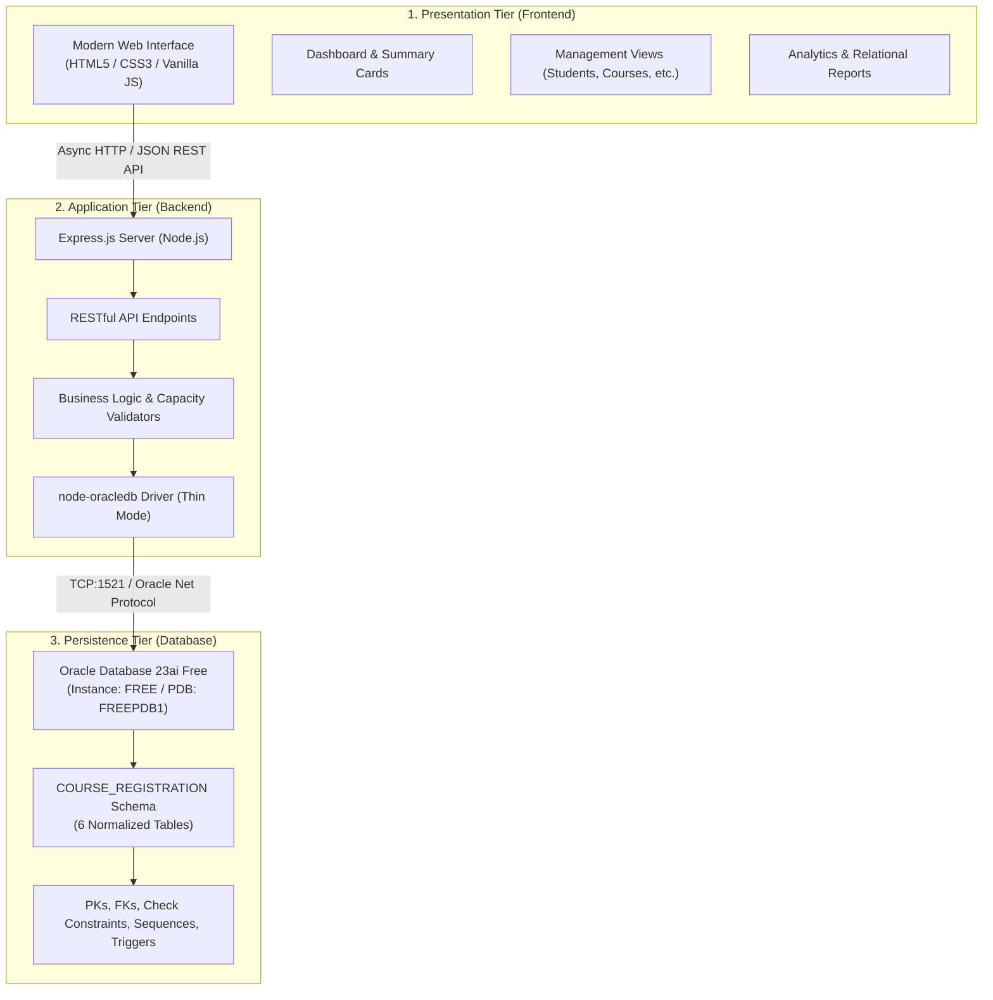

# System Architecture & Development Plan
## Project: Course Registration System

---

### 1. Architectural Overview

The Course Registration System is structured as a clean, decoupled 3-tier architecture designed specifically for educational clarity, high performance, and rapid demonstration in a university DBMS laboratory.



---

### 2. Local Environment Inspection Findings

An automated scan of the local Windows 11 host revealed the following:

| Component | Status | Details / Path |
|---|---|---|
| **Oracle Database** | **Installed & Running** | Oracle Database 23ai Free (v23.26.0.0.0)<br>CDB: `FREE`, PDB: `FREEPDB1`<br>Service: `OracleServiceFREE` (Running) |
| **Oracle Listener** | **Active on Port 1521** | Service: `OracleOraDB23Home1TNSListener`<br>Endpoint: `127.0.0.1:1521` (TCP) |
| **SQL*Plus** | **Available & Tested** | `C:\app\Lenovo\product\26ai\dbhomeFree\bin\sqlplus.exe`<br>Tested working via `sqlplus -s / as sysdba` |
| **Database Schema** | **PDB User Exists** | User `COURSE_REGISTRATION` already exists in `FREEPDB1` |
| **VS Code** | **Installed** | `E:\Users\Lenovo\AppData\Local\Programs\Microsoft VS Code\bin\code.cmd` |
| **Package Manager** | **Installed** | Windows Package Manager (`winget` v1.29.380) |
| **Node.js / Python / Java**| **Not yet installed** | Available for 1-click silent installation via `winget` |

---

### 3. Recommended Application Technology Stack

To satisfy the user requirement for the **simplest, most reliable stack without over-engineering**:

1. **Database**: **Oracle Database 23ai Free** (utilizing SQL*Plus for all script execution).
2. **Backend**: **Node.js (LTS)** with **Express.js**.
   - *Rationale*: Node.js has the official `oracledb` package developed by Oracle. In modern versions (v6+), `node-oracledb` operates in **Thin Mode by default**, which communicates directly with Oracle Database via Oracle Net protocol over TCP port 1521. This means **no Oracle Instant Client binaries, no C++ build tools, and no manual DLL path configurations are needed**. It connects natively and flawlessly out of the box.
3. **Frontend**: **Vanilla HTML5, CSS3, and JavaScript** (Fetch API).
   - *Rationale*: No heavy frontend build steps (no Webpack, Vite, React, or Angular compiling). The files can be served directly as static assets by Express.js. Any browser runs it immediately, and any student can understand every line of code during viva.

---

### 4. Proposed Project Directory Structure

```
DBMS/
│
├── database/                          # Oracle SQL*Plus scripts
│   ├── 00_init_user.sql               # PDB session setup & user grants
│   ├── 01_create_tables.sql           # DDL: 6 core tables
│   ├── 02_constraints.sql             # Primary, Foreign, Unique, Check constraints
│   ├── 03_sequences.sql               # Oracle sequences for surrogate keys
│   ├── 04_triggers.sql                # Simple BEFORE INSERT triggers for auto-IDs
│   ├── 05_insert_sample_data.sql      # Realistic academic dataset
│   ├── 06_basic_queries.sql           # Single table, WHERE, ORDER BY
│   ├── 07_join_queries.sql            # INNER JOIN, LEFT JOIN
│   ├── 08_aggregate_queries.sql       # COUNT, SUM, AVG, MIN, MAX, GROUP BY, HAVING
│   ├── 09_subqueries.sql              # IN, NOT IN, correlated subqueries
│   ├── 10_views.sql                   # Relational views for reporting
│   └── run_all.sql                    # SQL*Plus master runner script
│
├── backend/                           # Application layer (Express.js)
│   ├── server.js                      # Express application entry point
│   ├── db.js                          # Centralized Oracle connection pool module
│   └── routes/                        # Modular route controllers
│       ├── dashboard.js               # Aggregate statistics API
│       ├── departments.js             # Department CRUD endpoints
│       ├── students.js                # Student CRUD endpoints
│       ├── instructors.js             # Instructor CRUD endpoints
│       ├── courses.js                 # Course CRUD endpoints
│       ├── sections.js                # Course Section CRUD endpoints
│       ├── registrations.js           # Registration & capacity logic
│       └── reports.js                 # Academic reports API
│
├── frontend/                          # Client presentation tier
│   ├── index.html                     # Main Single Page App container
│   ├── css/
│   │   └── style.css                  # Clean, modern, responsive CSS styling
│   └── js/
│       ├── app.js                     # Navigation, router, state management
│       └── api.js                     # REST API client calls
│
├── docs/                              # Project documentation & viva preparation
│   ├── requirements.md                # System requirements specification
│   ├── database_design.md             # Schema, constraints, ERD, 3NF analysis
│   ├── architecture.md                # Architecture, tech stack & setup guide
│   ├── testing.md                     # Test matrix (Phase 7)
│   └── viva_questions.md              # Viva Q&A with deep explanations (Phase 8)
│
├── .env.example                       # Template for database credentials
├── .gitignore                         # Standard Node / Oracle gitignore
├── package.json                       # Dependencies (express, oracledb, dotenv, cors)
└── README.md                          # Comprehensive setup, run, and viva guide
```

---

### 5. SQL*Plus Execution Order

All database scripts are executed sequentially in SQL*Plus. The master `run_all.sql` script coordinates the complete execution:

1. **Connect**: Connect to PDB (`FREEPDB1`) as schema user `COURSE_REGISTRATION`.
2. **Tables (`01_create_tables.sql`)**: Create the 6 core tables with clean column definitions.
3. **Constraints (`02_constraints.sql`)**: Apply Primary Keys, Foreign Keys, Unique constraints, and Check constraints.
4. **Sequences (`03_sequences.sql`)**: Create sequences for all 6 tables.
5. **Triggers (`04_triggers.sql`)**: Create `BEFORE INSERT` triggers to auto-assign IDs.
6. **Sample Data (`05_insert_sample_data.sql`)**: Insert comprehensive, realistic academic records.
7. **Views (`10_views.sql`)**: Create reporting views for quick multi-table querying.
8. **Test Queries (`06` to `09`)**: Run verification queries to test relational integrity, joins, aggregates, and subqueries.

---

### 6. Phase-by-Phase Development Roadmap

| Phase | Milestone | Description |
|---|---|---|
| **Phase 1** | **Analyze & Design (Current)** | Requirements verification, schema verification, environment inspection, architecture documentation. *(Awaiting user sign-off)* |
| **Phase 2** | **Database Creation** | Write & execute Oracle DDL, constraints, sequences, triggers, and sample data via SQL*Plus in `FREEPDB1`. Validate all constraints. |
| **Phase 3** | **SQL Query Engineering** | Write & verify queries: basic, joins, aggregations, subqueries, and views via SQL*Plus. |
| **Phase 4** | **Backend Integration** | Install Node.js runtime, implement Express REST API, centralized Oracle connection pool (`node-oracledb`), CRUD handlers, capacity & duplicate checks. |
| **Phase 5** | **Frontend Construction** | Build clean, professional dashboard and UI for all 6 entities + reports view using HTML/CSS/JS. |
| **Phase 6** | **Full-Stack Integration** | Connect frontend to backend, test all end-to-end user workflows, ensure smooth error handling. |
| **Phase 7** | **Rigorous Testing** | Execute and record test matrix in `testing.md` (duplicate registration, capacity overflow, FK violation, invalid email, etc.). |
| **Phase 8** | **Academic Documentation & Viva Prep** | Finalize `README.md`, `viva_questions.md` covering DBMS, SQL, Oracle, Normalization, Transactions, and project-specific questions. |
