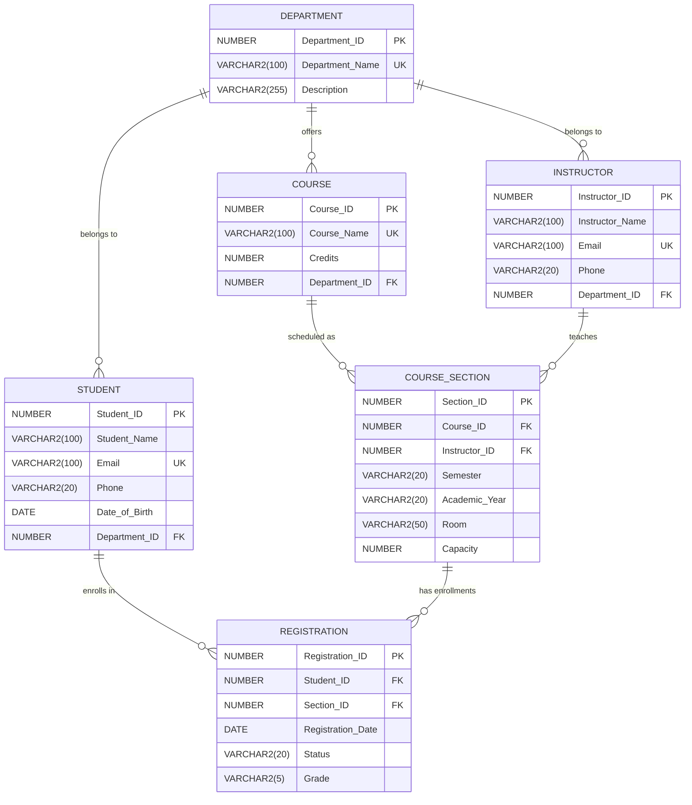

# Database Design Specification
## Project: Course Registration System (Oracle Database)

---

### 1. Authoritative Relational Schema

The relational schema consists of six core entities designed in 3rd Normal Form (3NF) to manage academic registrations without redundant attributes or anomalous dependencies.



---

### 2. Table Specifications & Oracle Constraints

#### 2.1 Table: `DEPARTMENT`
Represents academic departments (e.g., Computer Science, Mechanical Engineering).

| Column Name | Data Type | Constraints | Description |
|---|---|---|---|
| `Department_ID` | `NUMBER` | `PRIMARY KEY` | Unique identifier for department |
| `Department_Name` | `VARCHAR2(100)` | `NOT NULL, UNIQUE` | Name of the department |
| `Description` | `VARCHAR2(255)` | `NULL` | Department overview/notes |

#### 2.2 Table: `STUDENT`
Represents admitted students enrolled in a department.

| Column Name | Data Type | Constraints | Description |
|---|---|---|---|
| `Student_ID` | `NUMBER` | `PRIMARY KEY` | Unique identifier for student |
| `Student_Name` | `VARCHAR2(100)` | `NOT NULL` | Full name of the student |
| `Email` | `VARCHAR2(100)` | `NOT NULL, UNIQUE` | Academic/contact email |
| `Phone` | `VARCHAR2(20)` | `NULL` | Contact phone number |
| `Date_of_Birth` | `DATE` | `NOT NULL` | Student birth date |
| `Department_ID` | `NUMBER` | `NOT NULL, FOREIGN KEY -> DEPARTMENT(Department_ID)` | Enrolled department |

#### 2.3 Table: `INSTRUCTOR`
Represents academic faculty members.

| Column Name | Data Type | Constraints | Description |
|---|---|---|---|
| `Instructor_ID` | `NUMBER` | `PRIMARY KEY` | Unique identifier for faculty |
| `Instructor_Name` | `VARCHAR2(100)` | `NOT NULL` | Full name of instructor |
| `Email` | `VARCHAR2(100)` | `NOT NULL, UNIQUE` | Faculty email address |
| `Phone` | `VARCHAR2(20)` | `NULL` | Office/mobile phone |
| `Department_ID` | `NUMBER` | `NOT NULL, FOREIGN KEY -> DEPARTMENT(Department_ID)` | Parent department |

#### 2.4 Table: `COURSE`
Represents master course catalog items.

| Column Name | Data Type | Constraints | Description |
|---|---|---|---|
| `Course_ID` | `NUMBER` | `PRIMARY KEY` | Unique identifier for course |
| `Course_Name` | `VARCHAR2(100)` | `NOT NULL, UNIQUE` | Title of the academic course |
| `Credits` | `NUMBER` | `NOT NULL, CHECK (Credits > 0)` | Academic credit weighting |
| `Department_ID` | `NUMBER` | `NOT NULL, FOREIGN KEY -> DEPARTMENT(Department_ID)` | Offering department |

#### 2.5 Table: `COURSE_SECTION`
Represents a scheduled offering of a course in a given term and classroom, assigned to a specific instructor.

| Column Name | Data Type | Constraints | Description |
|---|---|---|---|
| `Section_ID` | `NUMBER` | `PRIMARY KEY` | Unique identifier for section |
| `Course_ID` | `NUMBER` | `NOT NULL, FOREIGN KEY -> COURSE(Course_ID)` | Course being offered |
| `Instructor_ID` | `NUMBER` | `NOT NULL, FOREIGN KEY -> INSTRUCTOR(Instructor_ID)` | Assigned faculty |
| `Semester` | `VARCHAR2(20)` | `NOT NULL` | Term (e.g., 'Odd', 'Even', 'Fall', 'Spring') |
| `Academic_Year` | `VARCHAR2(20)` | `NOT NULL` | Academic Year (e.g., '2025-2026') |
| `Room` | `VARCHAR2(50)` | `NOT NULL` | Classroom or lab venue |
| `Capacity` | `NUMBER` | `NOT NULL, CHECK (Capacity > 0)` | Max student enrollment limit |

#### 2.6 Table: `REGISTRATION`
The associative entity resolving the Many-to-Many ($M:N$) relationship between `STUDENT` and `COURSE_SECTION`.

| Column Name | Data Type | Constraints | Description |
|---|---|---|---|
| `Registration_ID` | `NUMBER` | `PRIMARY KEY` | Unique registration receipt ID |
| `Student_ID` | `NUMBER` | `NOT NULL, FOREIGN KEY -> STUDENT(Student_ID)` | Registering student |
| `Section_ID` | `NUMBER` | `NOT NULL, FOREIGN KEY -> COURSE_SECTION(Section_ID)` | Target course section |
| `Registration_Date`| `DATE` | `DEFAULT SYSDATE, NOT NULL` | Date of enrollment |
| `Status` | `VARCHAR2(20)` | `DEFAULT 'REGISTERED', NOT NULL, CHECK (Status IN ('REGISTERED', 'DROPPED', 'COMPLETED'))` | Enrollment state |
| `Grade` | `VARCHAR2(5)` | `NULL, CHECK (Grade IN ('A+', 'A', 'B+', 'B', 'C+', 'C', 'D', 'F', NULL))` | Final grade letter |

**Compound Unique Constraint:**
```sql
CONSTRAINT uq_student_section UNIQUE (Student_ID, Section_ID)
```
*Purpose:* Precludes a student from registering multiple times into the exact same course section.

---

### 3. Cardinality and Relationship Analysis

1. **Department to Student ($1:M$)**:
   - One department accommodates multiple students.
   - Each student is associated with exactly one primary academic department.
2. **Department to Instructor ($1:M$)**:
   - One department employs multiple instructors.
   - Each instructor belongs to one home department.
3. **Department to Course ($1:M$)**:
   - One department offers multiple syllabus courses.
   - Each course belongs to one parent department.
4. **Course to Course Section ($1:M$)**:
   - A single course catalog entry can have multiple class sections across semesters/years.
   - Each section pertains to exactly one course.
5. **Instructor to Course Section ($1:M$)**:
   - An instructor can teach multiple course sections across time or schedules.
   - Each course section is mentored by one designated instructor.
6. **Student to Course Section ($M:N$)**:
   - A student enrolls in multiple course sections.
   - A course section holds multiple students.
   - This $M:N$ cardinality is resolved via the **`REGISTRATION`** associative entity.

---

### 4. Normalization Analysis (1NF, 2NF, 3NF)

#### First Normal Form (1NF)
- **Criterion**: All attributes contain atomic (indivisible) values; no repeating groups or multivalued columns; each table has a defined primary key.
- **Verification**:
  - Phone and Email store individual atomic values.
  - No arrays, comma-delimited strings, or repeated columns (e.g., `Course1`, `Course2`).
  - Every table possesses an explicit primary key (`Department_ID`, `Student_ID`, `Instructor_ID`, `Course_ID`, `Section_ID`, `Registration_ID`).

#### Second Normal Form (2NF)
- **Criterion**: Must be in 1NF and all non-key attributes must be fully functionally dependent on the entire primary key (no partial functional dependency).
- **Verification**:
  - In all master tables (`DEPARTMENT`, `STUDENT`, `INSTRUCTOR`, `COURSE`, `COURSE_SECTION`), primary keys are single-column numeric surrogates. Therefore, partial dependencies cannot exist.
  - In `REGISTRATION`, the primary key is `Registration_ID`. Even if considering `(Student_ID, Section_ID)` as a candidate key, non-key attributes (`Registration_Date`, `Status`, `Grade`) depend strictly on the combination of the student taking that specific section.

#### Third Normal Form (3NF)
- **Criterion**: Must be in 2NF and have no transitive functional dependencies ($X \rightarrow Y$ where $Y \rightarrow Z$, thus non-key attributes determining other non-key attributes).
- **Verification**:
  - `STUDENT` stores only direct student attributes plus `Department_ID`. Department names and descriptions are normalized into `DEPARTMENT`.
  - `COURSE_SECTION` stores `Course_ID` and `Instructor_ID`. It does not store `Course_Name`, `Credits`, or `Instructor_Name`, eliminating transitive dependencies.
  - `REGISTRATION` stores only IDs and registration attributes. It does not repeat student names, course titles, or semester info.

---

### 5. Oracle Sequence & Auto-ID Strategy

Because Oracle Database does not use MySQL's `AUTO_INCREMENT`, unique identifier assignment utilizes standard Oracle Sequences.

```sql
CREATE SEQUENCE dept_seq START WITH 1 INCREMENT BY 1 NOCACHE;
CREATE SEQUENCE student_seq START WITH 1 INCREMENT BY 1 NOCACHE;
CREATE SEQUENCE instructor_seq START WITH 1 INCREMENT BY 1 NOCACHE;
CREATE SEQUENCE course_seq START WITH 1 INCREMENT BY 1 NOCACHE;
CREATE SEQUENCE section_seq START WITH 1 INCREMENT BY 1 NOCACHE;
CREATE SEQUENCE reg_seq START WITH 1 INCREMENT BY 1 NOCACHE;
```

For seamless insertion without requiring callers to manually supply IDs, `BEFORE INSERT` triggers (or Oracle 23ai `DEFAULT <seq>.NEXTVAL`) automatically populate the primary keys:

```sql
CREATE OR REPLACE TRIGGER trg_student_id
BEFORE INSERT ON Student
FOR EACH ROW
WHEN (NEW.Student_ID IS NULL)
BEGIN
    :NEW.Student_ID := student_seq.NEXTVAL;
END;
/
```
*(This is easily explained in viva: triggers execute automatically on the server prior to data storage, guaranteeing consecutive surrogate key generation).*

---

### 6. Section Capacity and Integrity Enforcement

1. **Section Capacity Invariant**:
   - Each `COURSE_SECTION` has a positive `Capacity` (e.g., 40).
   - Before inserting a new row in `REGISTRATION` with `Status = 'REGISTERED'`, the system queries:
     ```sql
     SELECT COUNT(*) AS active_count
     FROM Registration
     WHERE Section_ID = :section_id AND Status = 'REGISTERED';
     ```
   - If `active_count >= Capacity`, the registration is rejected with the message: **"Course section is full. Maximum capacity reached."**
2. **Duplicate Registration Invariant**:
   - Enforced both at the schema level via `CONSTRAINT uq_student_section UNIQUE (Student_ID, Section_ID)` and verified during application validation to return a friendly user message: **"Student is already registered for this section."**
3. **Referential Deletion Protection**:
   - Foreign keys intentionally omit `ON DELETE CASCADE`.
   - Attempting to delete an entity with active dependencies (e.g., Department with students, or Course with scheduled sections) raises Oracle `ORA-02292` (integrity constraint violated - child record found), which the application catches and translates into: **"Cannot delete this record because it is referenced by other active entities."**
