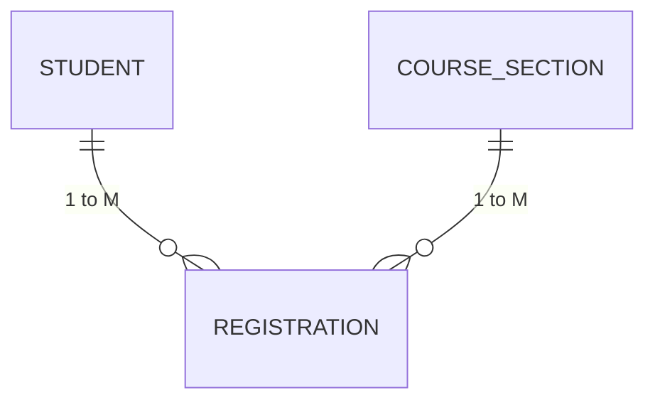

# Database Normalization Report
## Project: Course Registration System

---

### 1. Introduction to Normalization
Normalization is a systematic database design technique that organizes tables to minimize data redundancy and prevent data modification anomalies (Insertion, Update, and Deletion anomalies).

This project designs a relational database for a Course Registration System that satisfies **First Normal Form (1NF)**, **Second Normal Form (2NF)**, and **Third Normal Form (3NF)**.

---

### 2. Step-by-Step Normalization Analysis

#### 2.1 First Normal Form (1NF)
- **Rules for 1NF**:
  1. Each column must contain atomic (indivisible) single values.
  2. There must be no repeating groups or multiple columns storing similar information (e.g., `Course1`, `Course2`, `Course3`).
  3. Every table must have a unique identifier (Primary Key).
- **Application in Our Schema**:
  - `Student`: Name, email, phone, and date of birth are stored as single atomic scalar values.
  - No comma-separated lists (e.g., storing all registered section IDs inside a student column is strictly avoided).
  - Explicit single-column primary keys are defined for all tables:
    - `Department(Department_ID)`
    - `Student(Student_ID)`
    - `Instructor(Instructor_ID)`
    - `Course(Course_ID)`
    - `Course_Section(Section_ID)`
    - `Registration(Registration_ID)`
- **Conclusion**: The schema is strictly in **1NF**.

---

#### 2.2 Second Normal Form (2NF)
- **Rules for 2NF**:
  1. The database must be in 1NF.
  2. All non-key attributes must be **fully functionally dependent** on the complete primary key (no partial functional dependencies on composite candidate keys).
- **Application in Our Schema**:
  - In tables with single-column surrogate primary keys (`Department`, `Student`, `Instructor`, `Course`, `Course_Section`, `Registration`), partial functional dependency is mathematically impossible because primary keys cannot be subdivided.
  - In `REGISTRATION`, the composite candidate key is `(Student_ID, Section_ID)`.
    - `Registration_Date`, `Status`, and `Grade` depend on **both** the student and the section simultaneously (i.e., a student receives a grade only for that specific section of the course). None of these attributes depend solely on `Student_ID` or solely on `Section_ID`.
- **Conclusion**: The schema is strictly in **2NF**.

---

#### 2.3 Third Normal Form (3NF)
- **Rules for 3NF**:
  1. The database must be in 2NF.
  2. There must be no **transitive functional dependencies** ($X \rightarrow Y$ and $Y \rightarrow Z$, meaning a non-key attribute determining another non-key attribute).
  3. Formally: For every functional dependency $X \rightarrow Y$, either $X$ is a superkey or $Y$ is a prime attribute.
- **Application in Our Schema**:
  - **Department Separation**:
    - If `Department_Name` and `Description` were stored directly in `Student`, then $\text{Student\_ID} \rightarrow \text{Department\_ID} \rightarrow \text{Department\_Name}$. This would be a transitive dependency causing update anomalies. By separating `DEPARTMENT` into its own table, `Student` only references `Department_ID`.
  - **Instructor & Course Separation**:
    - `COURSE_SECTION` stores only `Course_ID` and `Instructor_ID`.
    - It does **not** store `Course_Name`, `Credits`, `Instructor_Name`, or `Instructor_Email`.
    - If course names were stored in `COURSE_SECTION`, updating a course title would require updating every section row (update anomaly).
  - **Registration Separation**:
    - `REGISTRATION` stores only foreign keys and enrollment-specific attributes (`Registration_Date`, `Status`, `Grade`).
    - It does **not** store student names or course descriptions.
- **Conclusion**: The schema is strictly in **3NF**.

---

### 3. Resolving the Many-to-Many ($M:N$) Relationship

In an academic institution:
- One student can enroll in multiple course sections.
- One course section accommodates multiple enrolled students.

Directly modeling an $M:N$ relationship between `STUDENT` and `COURSE_SECTION` within either table would lead to unnormalized repeating groups or massive data redundancy.

**Solution: The Associative Entity (`REGISTRATION`)**:
- The $M:N$ relationship is decomposed into two $1:M$ relationships:
  1. `STUDENT` ($1$) $\rightarrow$ `REGISTRATION` ($M$)
  2. `COURSE_SECTION` ($1$) $\rightarrow$ `REGISTRATION` ($M$)
- The `REGISTRATION` entity holds:
  - `Registration_ID` (Surrogate Primary Key)
  - `Student_ID` (Foreign Key referencing `STUDENT`)
  - `Section_ID` (Foreign Key referencing `COURSE_SECTION`)
  - Attributes specific to the relationship: `Registration_Date`, `Status`, `Grade`.
- Enforces uniqueness via: `CONSTRAINT uq_student_section UNIQUE (Student_ID, Section_ID)`.

---

### 4. Anomaly Prevention Summary

| Anomaly Type | Unnormalized Risk | How Our 3NF Schema Prevents It |
|---|---|---|
| **Insertion Anomaly** | Cannot create a department without first admitting a student or hiring an instructor. | `DEPARTMENT` exists independently; departments can be created prior to student enrollments. |
| **Update Anomaly** | Changing an instructor's email requires modifying dozens of course section rows. | Faculty profiles reside in `INSTRUCTOR`; updating email happens in exactly one place. |
| **Deletion Anomaly** | Deleting the last registered student in a course section inadvertently deletes the entire course from catalog. | `COURSE` and `COURSE_SECTION` exist independently from `REGISTRATION`. Cancelling an enrollment leaves course records intact. |
